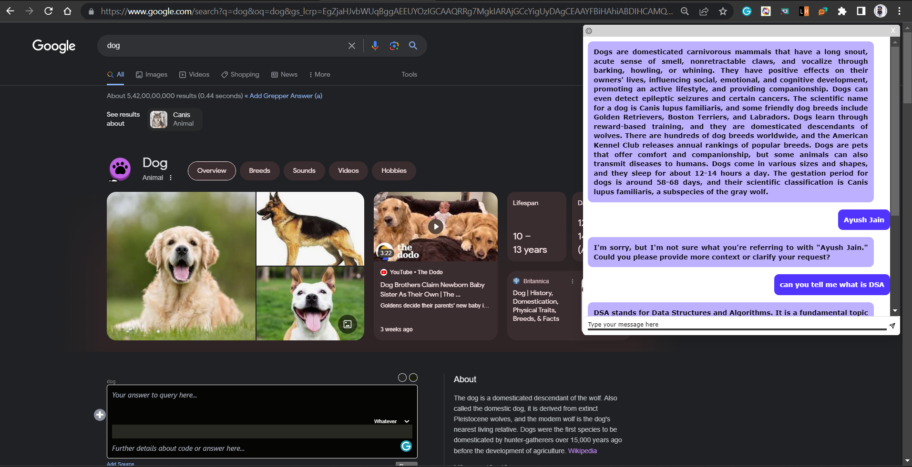

# Talk-to-AI 🤖
**Talk to AI** is a powerful chrome extension that enhances your browsing experience by providing summarized insights and facilitating interactive conversations about the web content. Using **ChatGPT**, you may go deep into the substance of web pages, engage in discourse, and obtain a full grasp of the topic. 

# How to install locally in you chrome browser
* Download Source Code from **Releases** section.
* Then visit [chrome://extensions/](chrome://extensions/) in your chrome browser.
* 

# For Example:-

